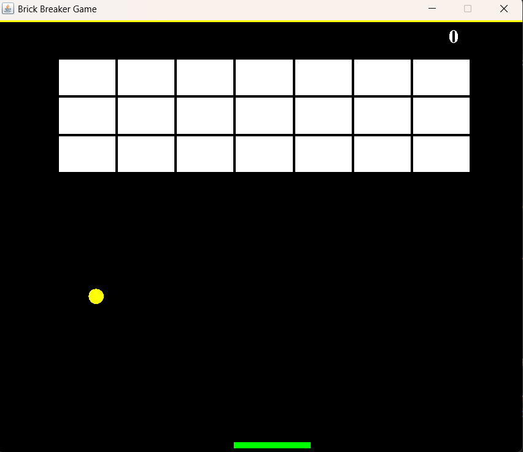

# 🧱 Brick Breaker Game

A classic Brick Breaker (Breakout) arcade-style game built using [Your Language/Framework]. Break all the bricks using a paddle and bouncing ball — but don't let the ball fall!



---

## 🚀 Features

- 🕹️ Smooth paddle movement
- 🔴 Ball physics with realistic bounce
- 🧱 Multiple levels with increasing difficulty
- 🌈 Colorful bricks and animations
- 💥 Power-ups (optional)
- 🎵 Sound effects (optional)

---

## 🛠️ Built With

- Language: `Python` / `JavaScript` / `Java` / etc.
- Framework: `Pygame` / `HTML5 Canvas` / `JavaFX` / etc.

---

## 📦 Installation

### Clone the Repository

```bash
git clone https://github.com/your-username/brick-breaker-game.git
cd brick-breaker-game
